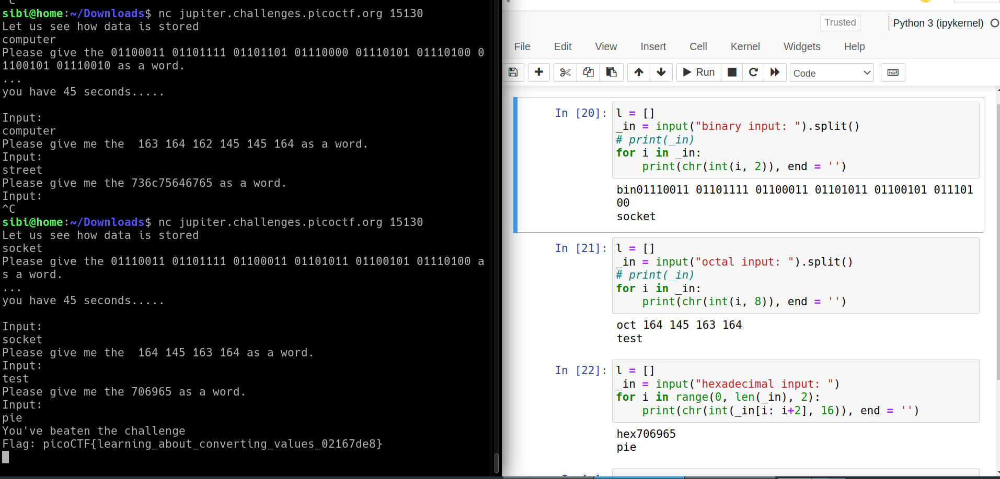

# picoCTF Based

---

author: sibi361
date: "2023-02-27"
category: General Skills
...

We are given a netcat hostname, on connecting to which we are given a bunch of numbers which look like binary numbers (base 2). We write a python script to convert them into base 10 and then subsequently use the `chr()` function to try and convert those numbers to characters as they look like ASCII codes.

After submitting the entered word in the netcat screen, we are given another bunch of numbers which after some trial and error, we find that they are octal (base 8) numbers. In the last step we are given a string which actually consist of hexadecimal numbers, two characters at a time. To decrypt these last two steps we follow the same approach as in step one and thus write a python script to do it.

...
End of writeup
