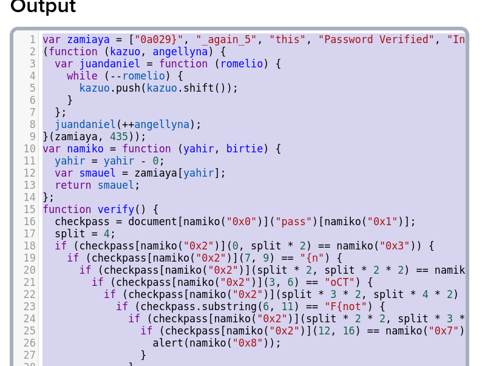

# picoCTF Client-side-again

---

author: sibi361
date: "2023-02-24"
category: Web Exploitation

---

We are given the link https://jupiter.challenges.picoctf.org/problem/6353/ where we are presented with a form containing a single input field just like in the _picoCTF dont-use-client-side_ challenge. On going through the the website's source code, on `line 10` we see a long script with obfuscated variable names. The form's submit button, when pressed called the `verify()` function.

We de-obfuscate the javascript using a un-obfuscator tool like https://deobfuscate.io/ after doing which we get this:

---

After going through this script, we can see that the `verify()` function is matching parts of the user input with the contents of the array `zamiaya` This array seems to be carrying strings, some of which look like parts of the flag, for example, "picoCTF{", whereas others look like they might be used in different parts of the script.

Manually rearranging four elements in the array gives us the flag.

...
End of writeup
