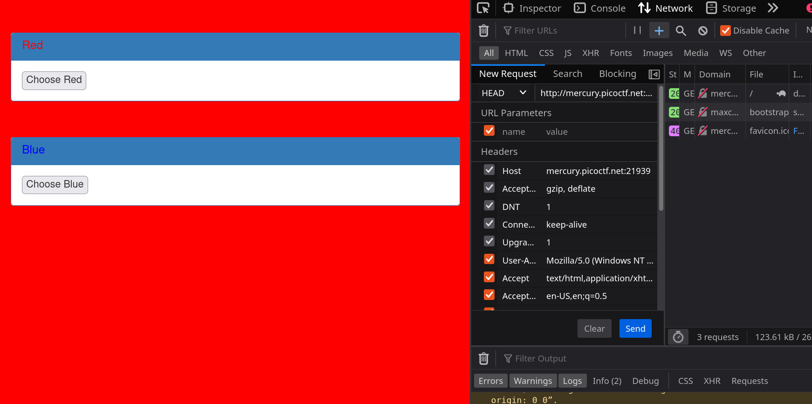
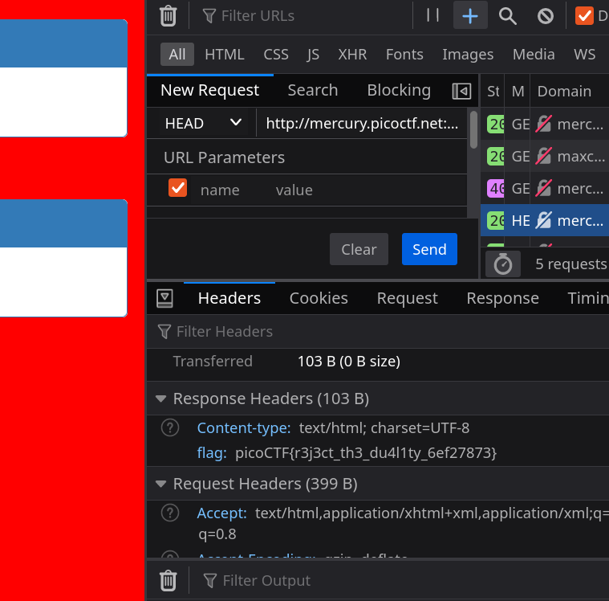

# picoCTF GET aHEAD

---

author: sibi361
date: "2023-02-24"
category: Web Exploitation

---

We are given the link http://mercury.picoctf.net:21939/ where we see a webpage with a red background along with buttons to change it to blue and back to red. One of the hints tell us that there can be "more than two choices". Going through the web requests made when the buttons are clicked, we can see that for switching to the blue background, a ["GET"](https://en.wikipedia.org/wiki/HTTP#Request_methods) request is sent whereas a ["POST"](https://en.wikipedia.org/wiki/HTTP#Request_methods) request gets us the red background.

---

The title of the challenge has the phrase "HEAD" which is actually another type of request such as "GET" and "POST". So we try sending a ["HEAD"](https://en.wikipedia.org/wiki/HTTP#Request_methods) request and that gets us the flag.

...
End of writeup
