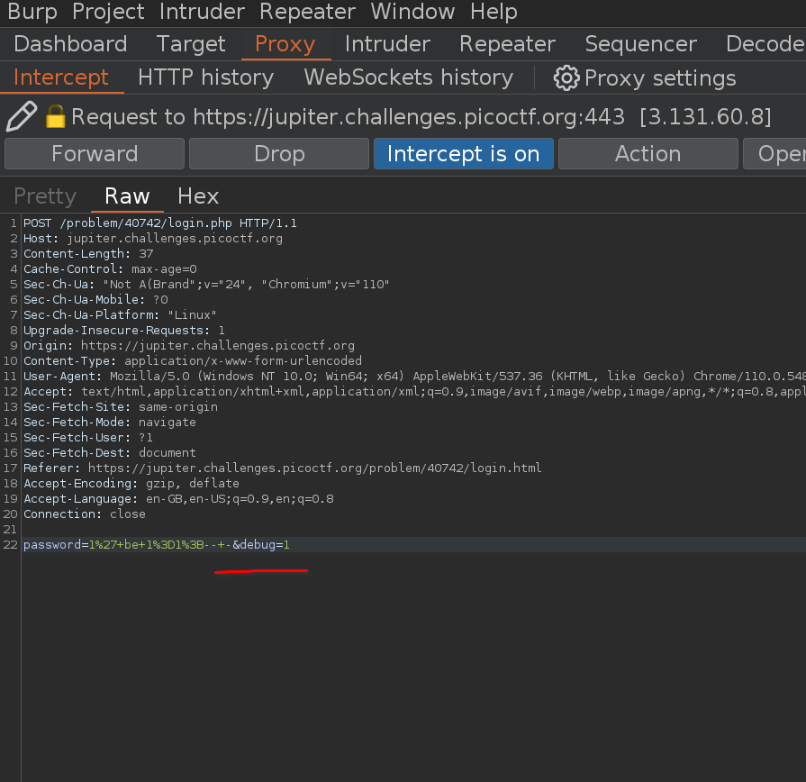

# picoCTF Irish-Name-Repo 1,2,3

---

author: sibi361
date: "2023-02-25"
category: Web Exploitation

---

All three of the challenges give us a website having an "Admin Login" page with a username and password field. Similar to the `picoCTF Web Gauntlet` challenge series, "mySQL Injection" is to be used.

For the first two challenges, that is, 1 and 2, providing `admin';-- -` logs us in and displays the flag. Here the semicolon `;` signifies the end of command and the `--` is used to comment out the rest of the query.

For the third part, we are given only a password field and the hint tells us that the password could be encrypted. Using a query like `1' or 1=1;-- -` causes the website to return `error 500`. So we proceed to analyze the network requests in Burp Suite.

Here we see another parameter named `debug` which is by default set to zero `0`. Modifying it to one `1` shows us the SQL query being executed in which we see that the word "or" in our password input has been replaced by "be". After a few more trials, we can say that the alphabets are being changed using the [ROT13](https://en.wikipedia.org/wiki/ROT13) cipher.

In order to bypass this we change our password input to `1' be 1=1;-- -` and that logs us in and displays the flag.

...
End of writeup
