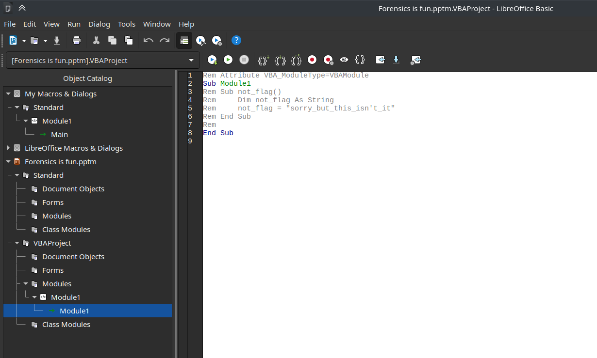

# picoCTF MacroHard WeakEdge

---

author: sibi361
date: "2023-02-08"
category: Forensics
...

We are given a PowerPoint file called "Forensics is fun.pptm". On opening it with [Libreoffice Impress](https://en.wikipedia.org/wiki/LibreOffice#Included_applications) we are warned that the pptm file contained macros. In simple words, macros are embedded scripts used to carry out tasks like adding images automatically.

After finding the pptm to be more or less empty, we proceed to the macros menu, where we find this macro which says that the flag isn't here.



Now we know that the flag isn't in a macro. The next step is to unzip the pptm itself because most Microsoft Office files are essentially just zipped archives having various files used by the document editors.

```
unzip Forensics\ is\ fun.pptm
```

On browsing through the folders that were in the pptm file, I found two files that seemed to be important:

```
ppt/vbaProject.bin
ppt/slideMasters/hidden
```

Running the `file` command on the `ppt/vbaProject.bin` returned `../vbaProject.bin: Composite Document File V2 Document, Cannot read section info`

Running the same command on `ppt/slideMasters/hidden` revealed that it's an ASCII text file. On viewing it, we find a bunch of characters separated by spaces:

```
Z m x h Z z o g c G l j b 0 N U R n t E M W R f d V 9 r b j B 3 X 3 B w d H N f c l 9 6 M X A 1 f Q
```

Guessing that it's encoded text, we try to base64 decode it after deleting the spaces:

```
cat hidden | tr -d ' ' | base64 -d
```

Which in turn gives us the flag.

...
End of writeup
