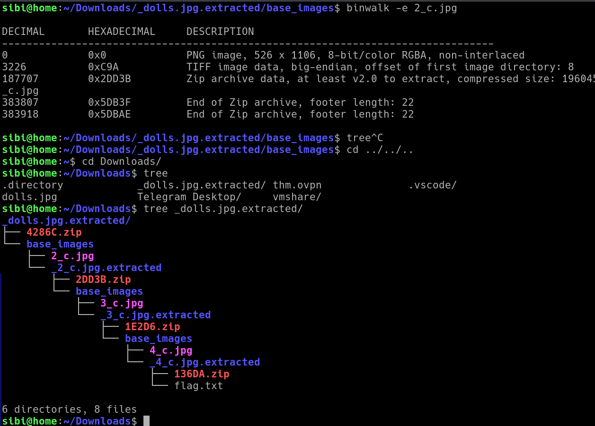

# picoCTF Matryoshka doll

---

author: sibi361
date: "2023-02-27"
category: Forensics
...

We are given an image file named `dolls.jpg` which when passed as an arguement to `binwalk` tells us that it has a zip archive embedded inside it. So we proceed to extract the zip using `binwalk` with its extract `-e` flag. This dumps all files hidden in the image file to the `_dolls.jpg.extracted` folder, in which we find a zip file named `4286C.zip` which itself contains another image file named `2_c.jpg`.

Running `binwalk` on this image tells us that even this file contains embedded zip files. So we repeat the steps done for the initial file on this file too, and on a few more subsequent files that follow to get the flag. The file tree below shows how much content was hidden in that single image `dolls.jpg`.

---

...
End of writeup
