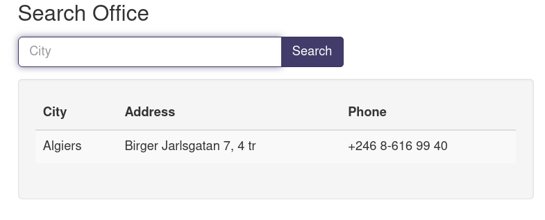
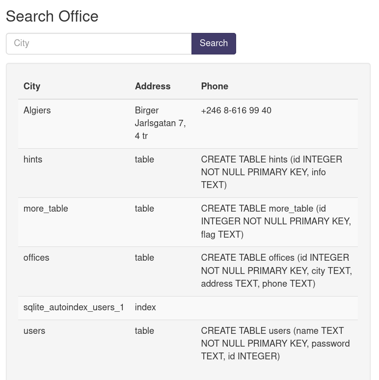

# picoCTF More SQLi

---

author: sibi361
date: "2023-03-19"
category: Web Exploitation
Event: picoCTF 2023
...

We are given a login form with a "Username" and "Password" field. The challenge hint says "SQLiLite". Considering this to be a MySQL Injection challenge, we submit the form with `' or 1 = 1;` as input, which logs us in. We are presented with a search box followed by a table containing three columns, namely, "City", "Address" and "Phone".

Searching for one of the cities listed in the table returns records of only that city. But misspelling the city name doesn't return any records showing that the backend probably runs a hardcoded MySQL query for every search, which might be like: `SELECT CITY, ADDRESS, PHONE FROM DATA WHERE CITY = <SEARCH-INPUT>`.

---

We know that in an SQLite database, the table `sqlite_master` stores the data regarding all tables. So we try to read it using the query `Algiers' union select name, type,sql from sqlite_master;`. Doing so discloses all the tables on the database, and we see that the table named `more_table` which a column called `flag`. So we try to read it using the query `Algiers' union select id,flag,null from more_table;` and that gets us the flag.

...
End of writeup
