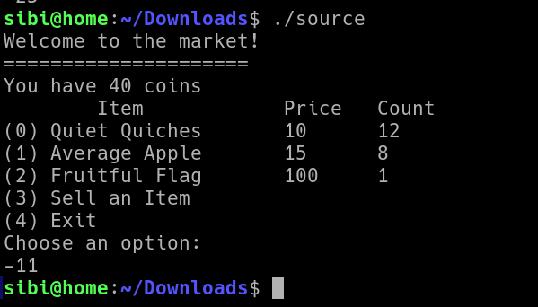
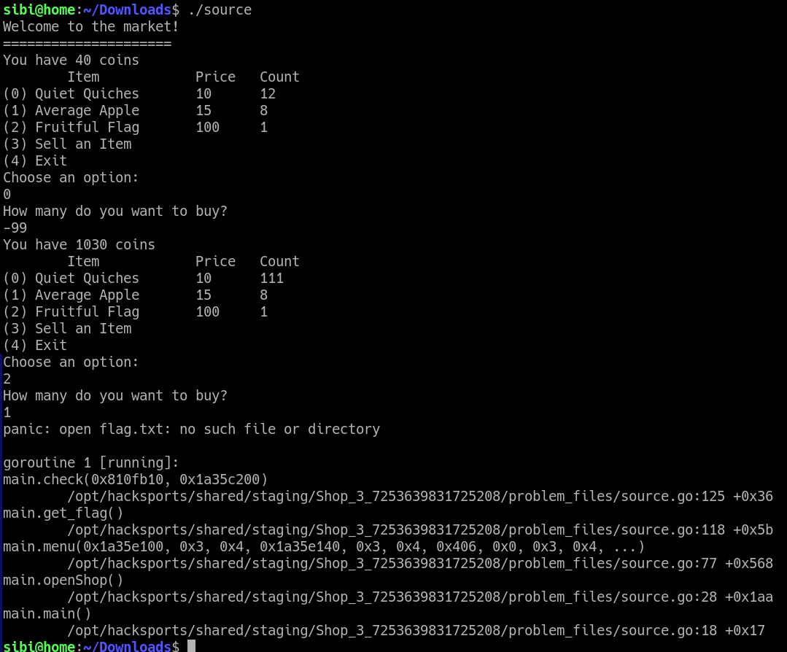
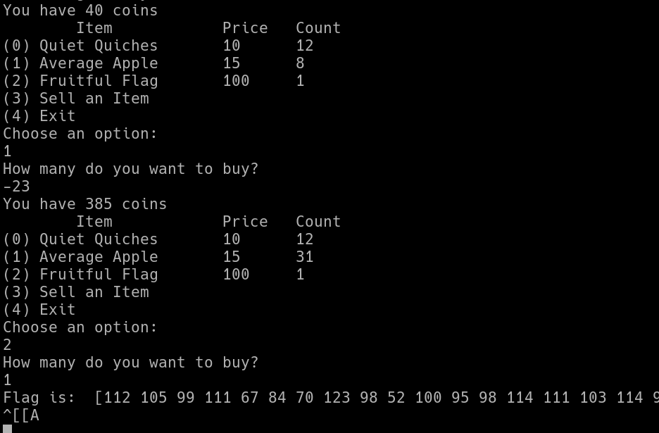

# picoCTF Shop

---

author: sibi361
date: "2023-02-15"
category: Reverse Engineering

---

We are given a file named `source` which on inspecting with [binwalk](https://github.com/ReFirmLabs/binwalk/), shows that it's an [GO](<https://en.wikipedia.org/wiki/Go!_(programming_language)>) executable/binary. Along with this we are given a netcat hint: `nc mercury.picoctf.net 34938`.

On running the `source` binary a menu-driven shop like interface is shown. The netcat connection also gives the same output. We can guess that we will get the flag if we buy the "Fruitful Flag" for a price of 100 coins. But we have only 40 coins.

Since the only hint on the challenge tells us to try edge cases, we give option numbers not present in the menu but that just quits the program.



---

Therefore we move on to giving very large values for the quantity such as `9999999999` as this might triger integer overflow errors. But even this doesn't show any abnormal behaviour probably because `GOLANG` is better at handling overflows than _cough cough_ C.

Through some more trial and error while in the `source` binary's menu, we finally get something by giving a negative quantity:



---

By performing the same steps on the netcat connection, we are presented with a set of characters which seem to be ASCII key codes:



Converting them to ASCII text with a python script gives us the flag.

```
codes = [112,105,99,111,67,84,70,123,98,52,100,95,98,114,111,103,114,97,109,109,101,114,95,98,97,54,98,56,99,100,102,125]
for i in codes:
	print(chr(i), end = '')

# returns the flag
```

---

Note: The netcat server and `source` file had identitcal programs running yet the challenge offered us both. This might have been done since we can could do trial and error faster on a locally saved binary as compared to an online connection which might get laggy.

...
End of writeup
