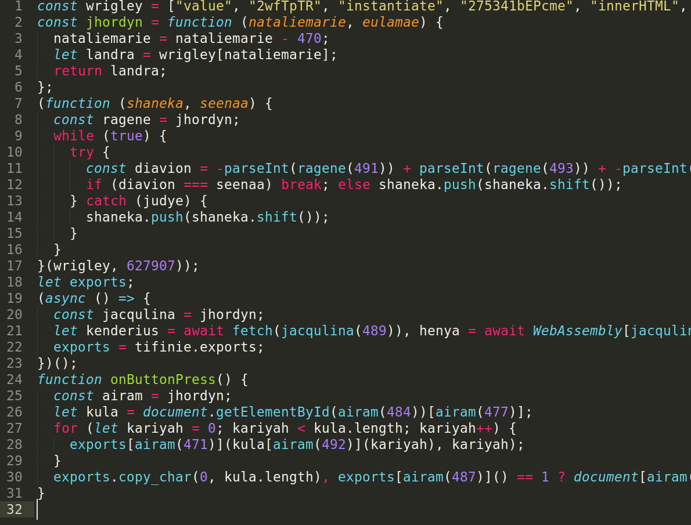
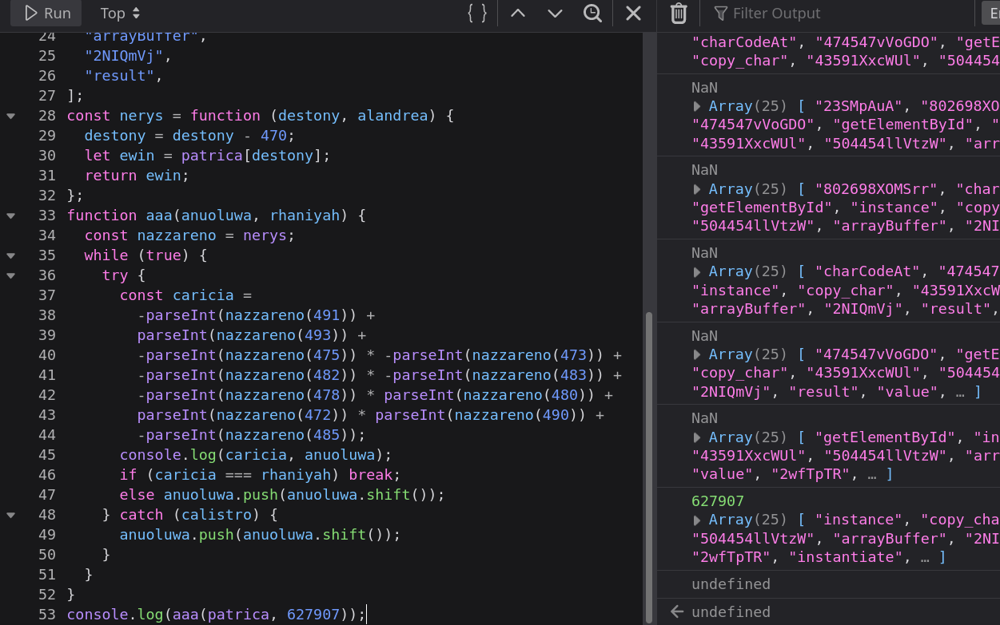
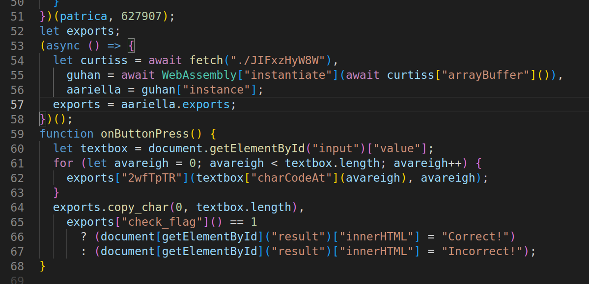
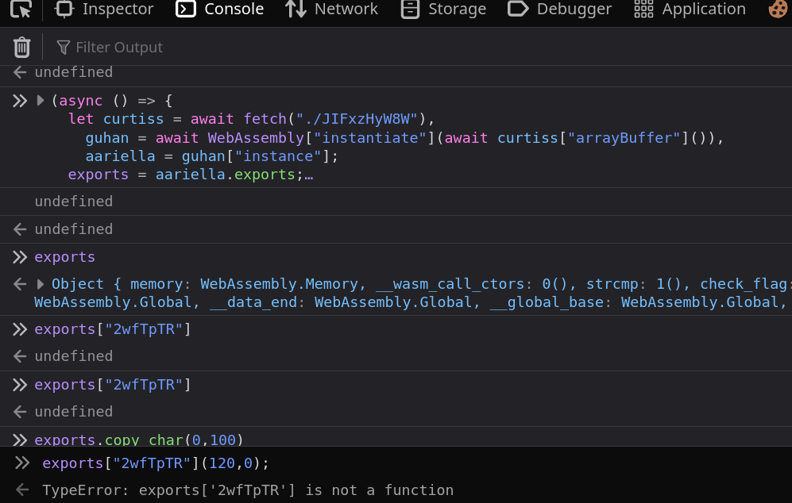
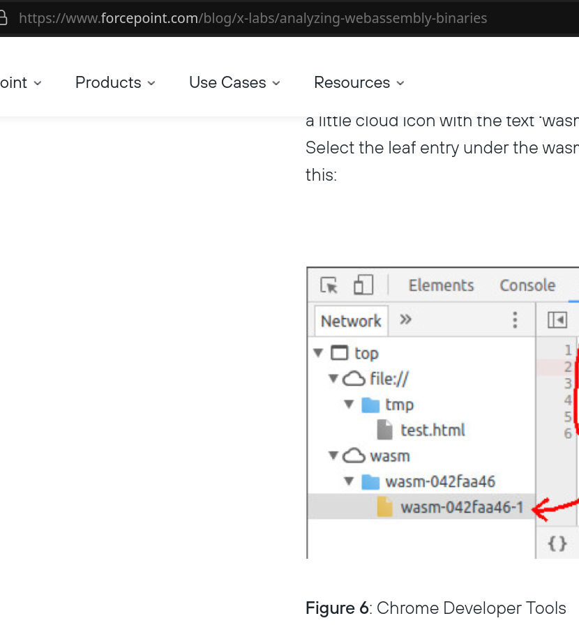
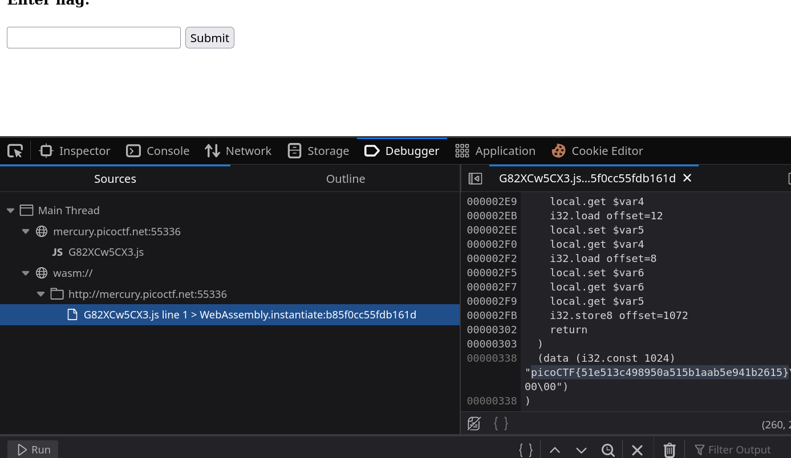

# picoCTF Some Assembly Required 1

---

author: sibi361
date: "2023-03-03"
category: Web Exploitation

---

We are given the link http://mercury.picoctf.net:55336/index.html which contains a textbox asing us to enter the flag. Submitting random values into this form returns a message saying "Incorrect!". Therefore in order to get the flag we need to go through the javascript that is doing the form validation.

On viewing the website's source code we can see that on submitting the form, the `onButtonPress()` function is called. There is one javascript file linked within the `<head>` tag: `G82XCw5CX3.js` which contains this function but has it's minified as well as obfuscated. So we pass it through a de-obfuscator such as https://deobfuscate.io/ after which we obtain this:



The array on the first line seems to be a storage for strings. On `line 7` we see a function that seems to be constructing an integer by performing arithmetic on numbers obtained with the ["parseInt()"](https://developer.mozilla.org/en-US/docs/Web/JavaScript/Reference/Global_Objects/parseInt) function, which in turn gets it's input from another function named `ragene()`. `ragene()` seems to return a string present in the `patrica` array, that is present at the index of the integer obtained, after subtracting `470` from the arguement passed to it. Knowing all this, we try to reverse engineer the script.

---



Now we see that the function actually rotates the array till the value of the numeric calculations equal `627907`.

---



Going to the url on `line 54` gives us a binary file of unknown format.

We manually substitute the values of the `nerys` decryption function to get better clarity. The `guhan` variable seems to contain a ["WebAssembly"](https://developer.mozilla.org/en-US/docs/WebAssembly) object which is then later exported to the `exports` varibale. `WebAssembly` is in simple terms a way to run programming languages like C/C++ in the browser. So the contents within `export` might be an executable.

The `charCodeAt()` function is used to return the UTF-16 character code of the given character. Hence the for loop seems to be running `line 62` passing the character code and index of every character in the textbox's input as arguments.

---

By now we have realised that there are two ways to call a function on an object in Javascript:

```
console.log("abcd".includes("a"));

console.log("abcd"["includes"]("a"));
```

---



We try examining further parts of the script by individually running them. Manually running `line 62` gives an error: `Uncaught TypeError: exports['2wfTpTR'] is not a function`.

The `copy_char` method on `line 64` is unknown. `exports["check_flag"]` on `line 65` is some sort of flag checker so we might have to reverse engineer it to get the flag.

---

> A few moments later



---



Oops.

> Lesson learnt: Check all tabs of devtools after page load / form submit.

...
End of writeup
