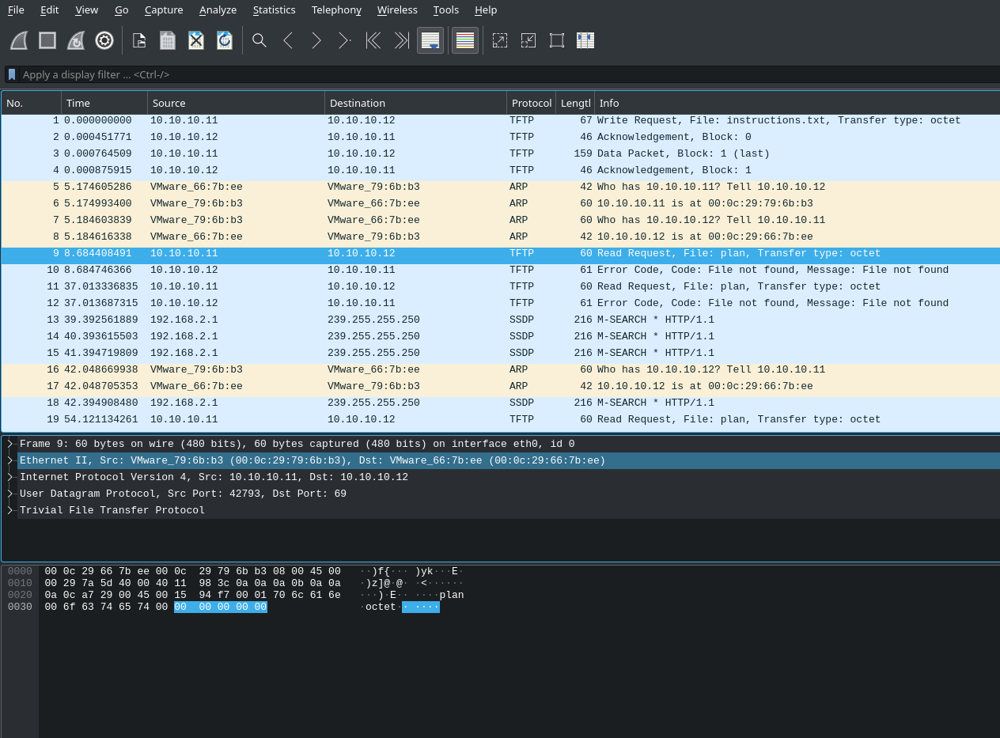
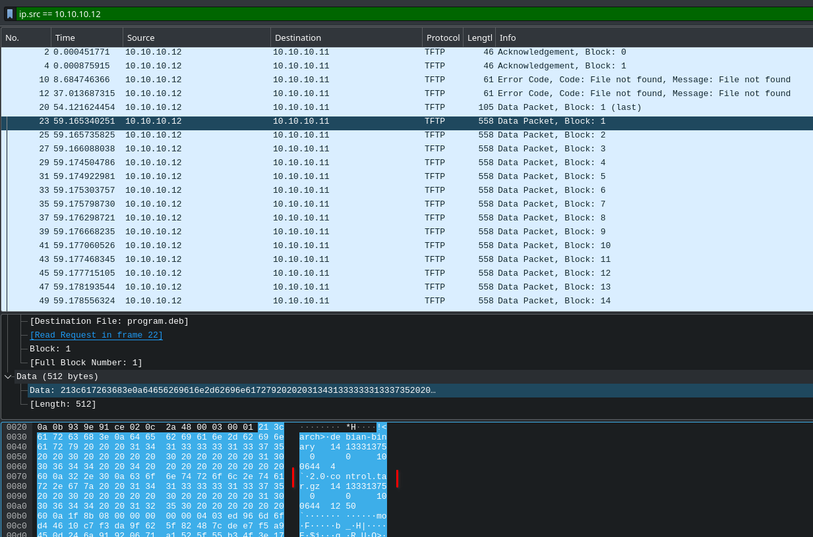
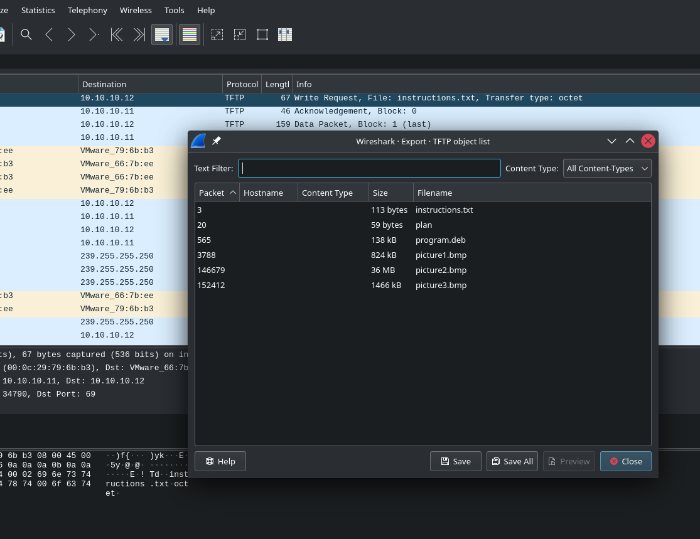
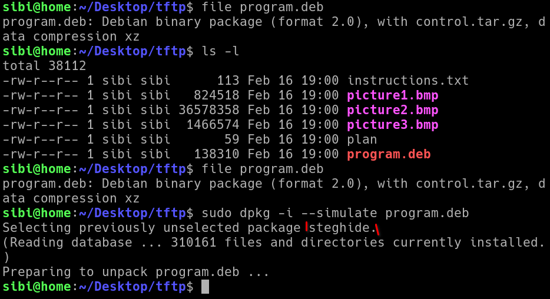
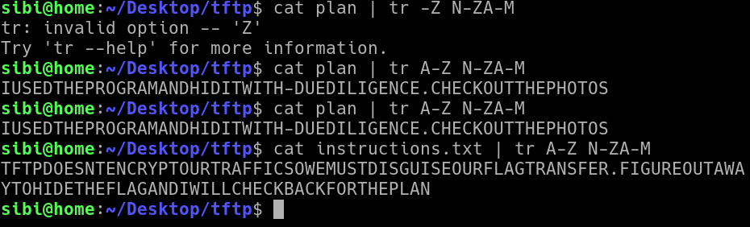
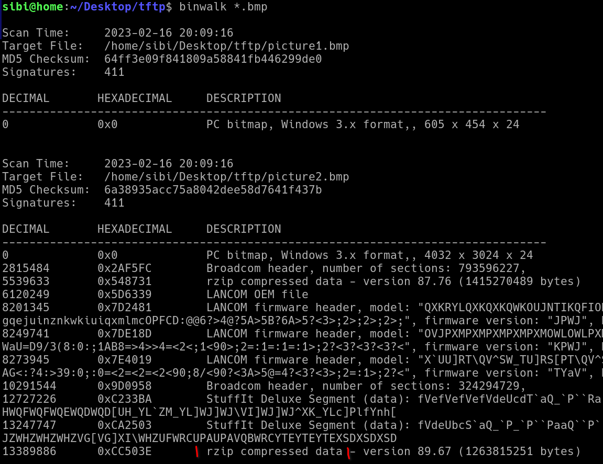
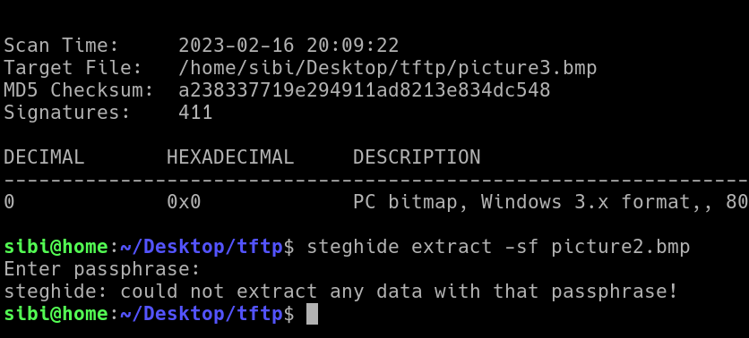

# picoCTF Trivial Flag Transfer Protocol

---

author: sibi361
date: "2023-02-15"
category: Forensics

---

We're given a ["packet dump" file](https://wiki.wireshark.org/Development/PcapNg) named `tftp.pcapng` which we open using [Wireshark](https://en.wikipedia.org/wiki/Wireshark).



---

Most of the packets are of the "TFTP" protocol with some [ARP](https://en.wikipedia.org/wiki/Address_Resolution_Protocol) packets in between. Also there seems to be a data transfer taking place using this very protocol as there are multiple [transmit-acknowledge sequences](https://en.wikipedia.org/wiki/Transmission_Control_Protocol#Connection_establishment). All the acknowledgement packets seem to be identical so we use the following search filter to filter them out

```
ip.src == 10.10.10.12 && tftp
```

On inspecting the packets further we see that packet number 23 is one of the first data packets and thus it's header carries the string "control.tar.gz" hence indicating that a compressed tar archive is being transmitted.



---

Thus we try to piece together the data packets so as to obtain the compressed tarball, hoping that this is not an encrypted protocol like HTTPS.

https://stackoverflow.com/questions/2916612/reconstructing-data-from-pcap-sniff suggests using [tcptrace](https://web.archive.org/web/20221201043700/http://tcptrace.org/) to piece together the packets but that's only for [TCP](https://en.wikipedia.org/wiki/Transmission_Control_Protocol) packets and here we are dealing with a made up protocol named `TFTP`.
Came across another tool like tcptrace: [Justniffer](https://onotelli.github.io/justniffer/) but it's development stopped long ago, unable to install it.

---

After going through Wireshark's menu's more closely we finally manage to find what we were looking for. `File > "Export Objects" > TFTP` shows us a list of files that wireshark managed to piece through from the data packets, we can now save these files and analyze them.



---

On running the `file` command on the `program.deb` file we see that it's a ["Debian binary package"](<https://en.wikipedia.org/wiki/Deb_(file_format)>). Since it might be dangerous to install the file on our system as it could be malicious, we run a simulation with [dpkg](https://en.wikipedia.org/wiki/Dpkg) and that tells us the package name: `steghide`. Doing a google search on it reveals that it's a [stenography program](https://steghide.sourceforge.net/) that is able to hide data in files, for example hide a ZIP file within an image file.



---

The two ASCII text files contain gibberish text which we guess to be [ROT13](https://en.wikipedia.org/wiki/ROT13) encoded and thus we decrypt them with the tr command. On going through the messages we realise that we have already figured out the hints that are being given. The `instructions.txt` file might have been supposed to be read while going through the packets in Wireshark :P.



---

Running binwalk on the three [BMP](https://en.wikipedia.org/wiki/BMP_file_format) files tells us that only `picture2.bmp` is useful as it has some compressed data embedded within it unlike the other two image files.



---

The data embedding was probably done using `steghide`, the stenography program that we discovered before. So we try to extract the data using the same program, but it asks for a password and we try everything we have:

- blank password
- the two text files, their filenames as well as contents
- their ROT13 decoded contents
- the word "DUEDILIGENCE" as it is placed after a hyphen.
- all the other filenames we got



---

#### PENDING

...
End of writeup
