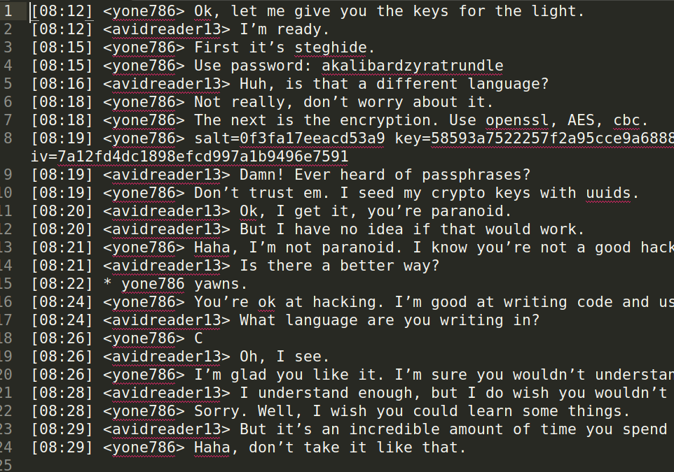

# picoCTF UnforgottenBits

---

author: sibi361
date: "2023-03-19"
category: Forensics
Event: picoCTF 2023
...

We are given a disk image file named `disk.flag.img`, which, when passed to the `mmls` command, we can see that it contains several partitions:

---

On mounting the disk image file using a disk image mounter, we browse through the filesystem's contents. We find some interesting stuff in the `/home` directory. We see four image files in the `/home/gallery` folder. Running `binwalk` on them reveals that `3.bmp` has hidden contents.

---

In the `/home/yone/irclogs/01/04/` folder, we find an [IRC](https://en.wikipedia.org/wiki/Irc) log file containing clues for extracting data from the `3.bmp` file.

---

As given in the IRC log, we use `steghide` to extract the hidden contents from the image, following which we use `openssl` to decrypt it. The final file seems to be the first few chapters of the book, "The Project Gutenberg of Frankenstein by Mary Wollstonecraft Shelley". The IRC logs have a mention of `C` code but this file has none of it. Comparing it with an actual copy of the book doesn't reveal any distinguishing changes either.

---

Blindly searching the filesystem also gives us nothing.

---

#### PENDING

...
End of writeup
