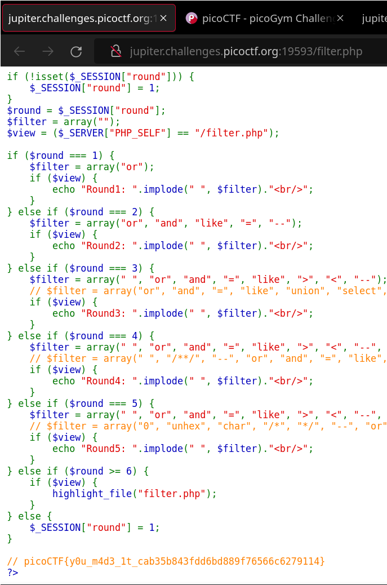

# picoCTF Web Gauntlet

---

author: sibi361
date: "2023-02-15"
category: Web Exploitation

---

This challenge asks to login as admin to the website http://jupiter.challenges.picoctf.org:19593/

Another webpage http://jupiter.challenges.picoctf.org:19593/filter.php contains blocked words that we can't use in the login form. In case we use them we are redirected to the form without any message from the server.

---

Now upon giving random input:
`SELECT * FROM users WHERE username='ww' AND password='dd'` the SQL query being exectued is shown in background.

Hoping that the form is vulnerable to SQL injection we try the classic `admin' AND 1=1;-- -` in the username field with a random password and that gets us to round 2. `--` is the SQL syntax for a comment and thus using it makes the rest of the query obselete and so the password never gets checked.


---

- Now upon refreshing filter page we see:

```
Round2: or and like = --
```

So comments(`--`) are not allowed. Thus do some research on how to use blocked characters.

Read a bunch of papers like http://www.it-docs.net/ddata/4954.pdf and try to crack the form with [homoglyphs](https://en.wikipedia.org/wiki/Homoglyph) using something like https://github.com/yamatt/homoglyphs

Try every line generated by this:

```
import homoglyphs_fork as hg
combinations = hg.Homoglyphs().get_combinations('-')

for i in combinations:
... print("admin'" + i\*2 + " -")
```

Finally googled the challenge and found that we had to use the second form of comments i.e. C style comments:

```
admin'/*
```

---

Now we reach round three, the same username gets us to round four where the username itself is blacklisted.

So build the word using string concatenation. The challenge hint says "sqlite" so we [try to find the syntax way to join two phrases in sqlite](https://portswigger.net/web-security/sql-injection/cheat-sheet) and that gets us to round five.

```
a'||'dmin'/*
```

One thing that we observe here is that for some reason putting `a'||'dmin/*` in the username field with a `*/` doesn't work.

---

Now we reach round five, the same username gets us to round six where it asks us to checkout the filters webpage. At the bottom of that page we see the flag.



...
End of writeup
