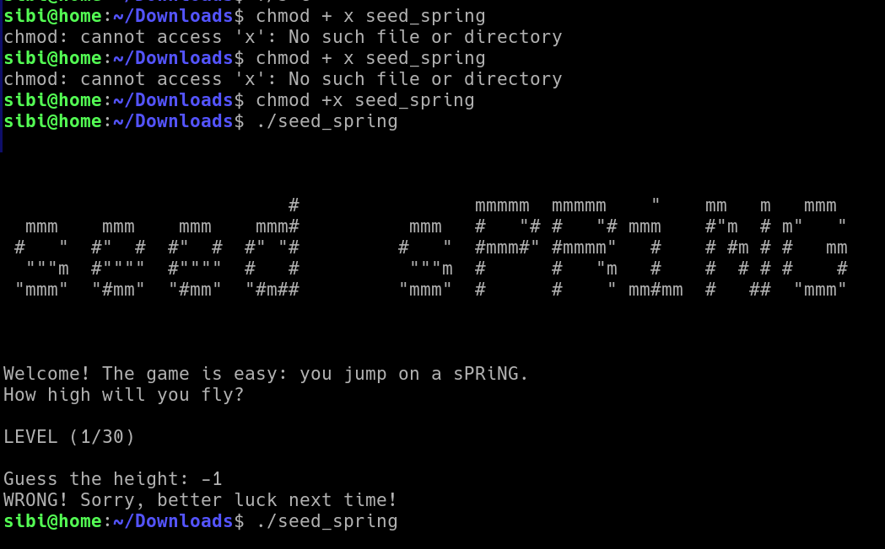
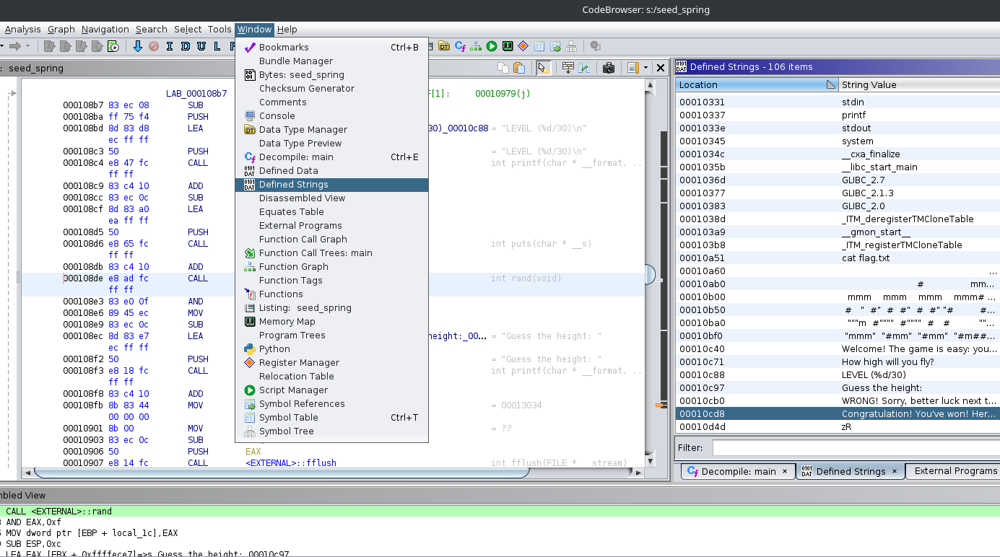
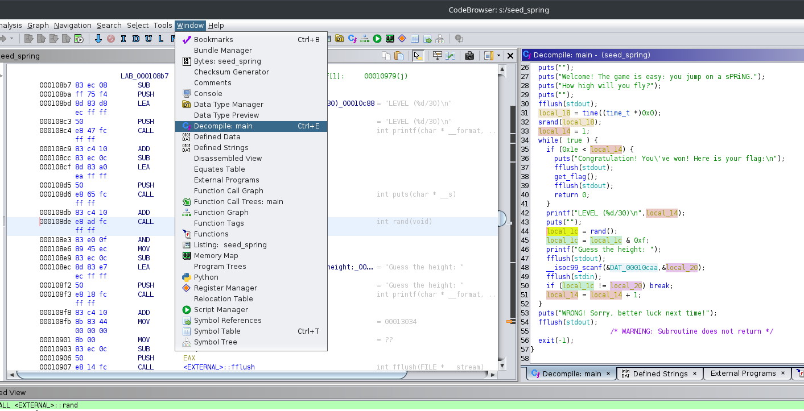
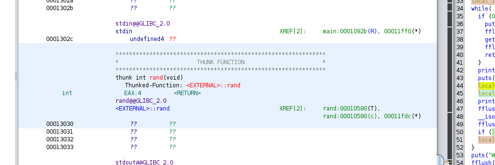
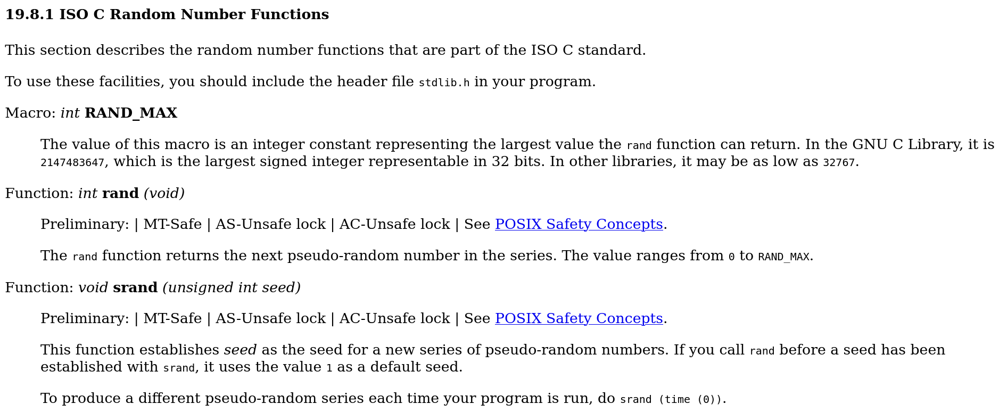

# picoCTF seed-sPRiNG

---

author: sibi361
date: "2023-02-19"
category: Binary Exploitation

---

We are given a single executable called `seed_spring` which when run prompts us to input a number to "guess the height". Giving absurd input such as abnormally high numbers or negative numbers returns no useful output.

Along with the executable we are given a host and a port, which when `netcat` we get the same prompt as given by the `seed_spring` program that we ran locally, indicating that the program running on the server is the same.

Therefore to obtain the flag we have to fiddle with the local program and find a number for the height that might give some error, which would imply that the number might be correct. Then we give that number as input to the `netcat` prompt which should give us the flag.

---

We start by trying to figure out the source code of the `seed_spring` binary using [Ghidra](https://en.wikipedia.org/wiki/Ghidra). First we have to [import the binary into the project](https://youtu.be/oTD_ki86c9I?t=454) after which we look for traces of the text that were shown to us by the program for example "Guess the height". This is done in order to quickly find the functions that do the input validation; "height checking" in this case.

`Window > Defined Strings` shows us all the strings in the program. Clicking on the strings in the right column takes us to the part of the program that has them.

---

Ghidra can now show us the probale function that included the string by using the Decompile tool: `Window > Decompile`. On the right hand side we can highlight the variables that seem to be of importance.

By going through the function we can see that the `get_flag()` function will be called only if the user has crossed level 30, that is, the variable `local_14 > 30`. `local_14` is set to `1` at start (before the `while` loop) and is incremented if and only if `local_1c` equals `local_20` where the former is the result of the `rand()` function and the latter is the user input. If the above said two variables are not equal, the `break` statement causes the `while` loop to break and the program quits after printing the "...Sorry..." message.

---

The `rand()` function when double clicked on, takes us to it's definition as shown below. We can see a mention of ["GLIBC_2.0"](https://www.gnu.org/software/libc/), the Standard Library of the C language. Going through the functions included in this library we find a mention of `rand`: https://www.gnu.org/software/libc/manual/html_node/ISO-Random.html#index-rand.

---

The last line in the below image seems to be useful because something similar is present on `line 32` of the code snippet, that first mentioned the `rand()` function. We also know now that the "random" value given by the `rand()` function can be manipulated by the `srand()` function. In the `seed_spring` script `srand()` is being run with the `time()` function as the arguement. This function returns the current time in the datatype `time_t` as mentioned at https://www.gnu.org/software/libc/manual/html_node/Getting-the-Time.html#index-time-1.

---

If the flag was saved locally we could have altered the program to print it out but since it's not with us we need to use the given host with `netcat`. Therefore now we have to find a way to simultaneously `netcat` the host while passing the output of the `rand()` function calculated locally to the `netcat` prompt. This should work if our local time matches the given hosts' time.

---

#### PENDING

...
End of writeup
