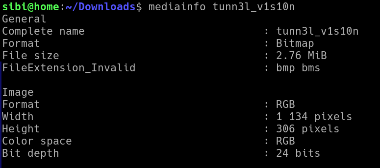
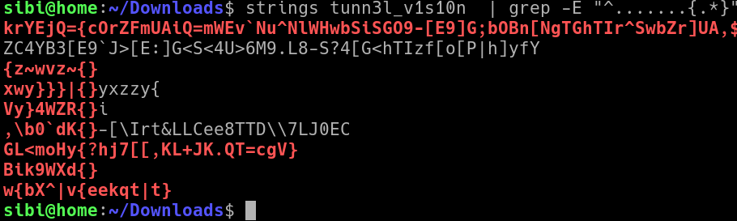

# picoCTF tunn3l v1s10n

---

author: sibi361
date: "2023-02-15"
category: Forensics

---

We're given a file named `tunn3l_v1s10n` which when run through `mediainfo`(https://en.wikipedia.org/wiki/MediaInfo) reveals that its a [BMP](https://en.wikipedia.org/wiki/BMP_file_format) image file.



---

But we are unable to open it with any image viewer. So we try to search for the flag amongst the ASCII strings present in it. The seven periods refer to "picoCTF" and the rest of the regex matches two curly braces with anything between them. This doesn't return anything promising.

```
strings tunn3l_v1s10n  | grep -E "^.......{.*}"
```



Reading the hexdump of the file doesn't show any patterns.

---

#### PENDING

...
End of writeup
