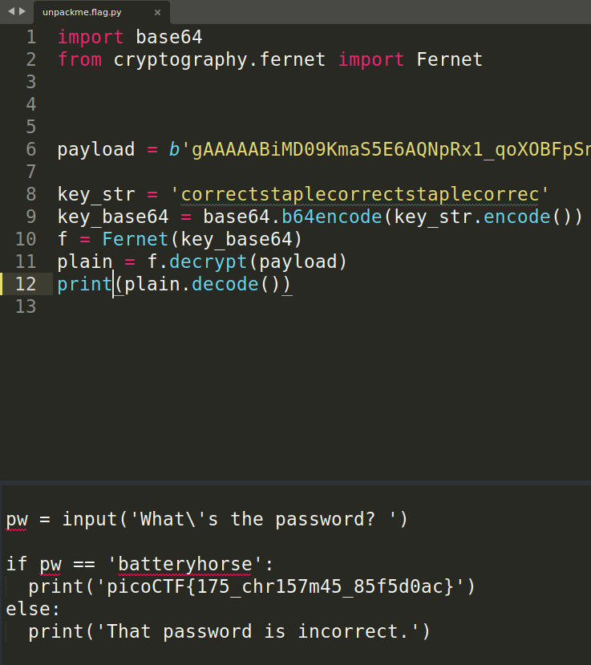

# picoCTF unpackme[.]py

---

author: sibi361
date: "2023-02-27"
category: Reverse Engineering
...

We are given a python script named `unpackme.py` which seems to be decrypting a [Ferret cipher](https://cryptography.io/en/latest/fernet/) encrypted payload. Running it as `python unpackme.py` prompts us for a password.

The last line of the script contains the `exec()` function with the decrypted data being passed to it as the arguement. This function executes anything that is given to it. Since we wish to see the decrypted contents of the payload, replacing the `exec()` function by the `print()` function shows us the payload, which apparently is a python script in itself.

This second script is what was prompting for the password and it also contains the flag.

---

...
End of writeup
