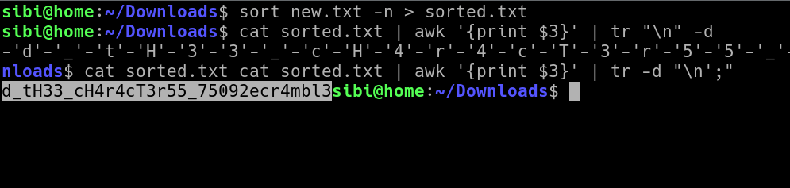

# picoCTF vault-door-1

---

author: sibi361
date: "2023-02-16"
category: Reverse Engineering

---

We are given a `java` file named `VaultDoor1.java`. The hint asks us to research on the [charAt() function available in java](https://www.w3schools.com/java/ref_string_charat.asp).

On looking closely at the `checkPassword()` function we see that it's evaluating the string between `"picoCTF{"` and `"}"` against these condtitions:

- line 23: the length of the string is 32 characters
- lines 24 till 55: the characters from [index](https://en.wikipedia.org/wiki/Zero-based_numbering) 0 till 31 match those in the phrase, this is done by using multiple `charAt()` functions.

Thus we can piece together the flag by sorting the lines 24 till 55 numerically in the order of the indexes and then doing some text-fu to grab the flag.

```
# new.txt:
password.charAt(0)  == 'd' &&
password.charAt(29) == '9' &&
password.charAt(4)  == 'r' &&
password.charAt(2)  == '5' &&
password.charAt(23) == 'r' &&
password.charAt(3)  == 'c' &&
password.charAt(17) == '4' &&
password.charAt(1)  == '3' &&
password.charAt(7)  == 'b' &&
password.charAt(10) == '_' &&
password.charAt(5)  == '4' &&
password.charAt(9)  == '3' &&
password.charAt(11) == 't' &&
password.charAt(15) == 'c' &&
password.charAt(8)  == 'l' &&
password.charAt(12) == 'H' &&
password.charAt(20) == 'c' &&
password.charAt(14) == '_' &&
password.charAt(6)  == 'm' &&
password.charAt(24) == '5' &&
password.charAt(18) == 'r' &&
password.charAt(13) == '3' &&
password.charAt(19) == '4' &&
password.charAt(21) == 'T' &&
password.charAt(16) == 'H' &&
password.charAt(27) == '5' &&
password.charAt(30) == '2' &&
password.charAt(25) == '_' &&
password.charAt(22) == '3' &&
password.charAt(28) == '0' &&
password.charAt(26) == '7' &&
password.charAt(31) == 'e';
```



...
End of writeup
