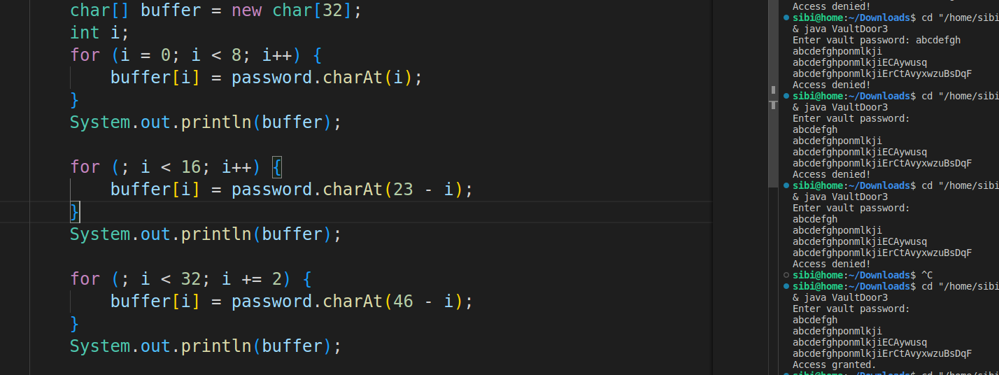
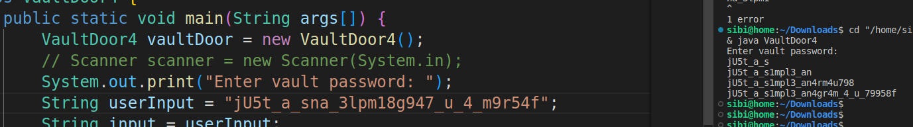

# picoCTF vault-door-3

---

author: sibi361
date: "2023-02-16"
category: Reverse Engineering

---

We are given a `java` file named `VaultDoor3.java`. By looking at the `checkPassword()` function we see that there's some character shuffling being done upon the user input, which results in a flag-like string at the bottom. Fourtunately, this string is not the actual flag as it doesn't work on the challenge website :P.

By adding some print statements in between the [for loops](https://en.wikipedia.org/wiki/For_loop) we can get a better idea of how to characters are moved.

---

Now it might seem that we have to reverse the effect of four for loops but to our advantage, simply supplying the given string at the bottom as input to the program gives us the flag. That is, in this case, performing the same set of operations used to encode the flag can also decode the flag.

...
End of writeup
