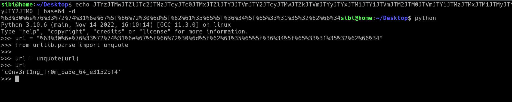

# picoCTF vault-door-5

---

author: sibi361
date: "2023-02-16"
category: Reverse Engineering

---

We are given a `java` file named `VaultDoor5.java`. The hint asks us to read about [base64](https://en.wikipedia.org/wiki/Base64). Therefore in order to obtain the flag, we probably need to decode a base64 encoded string.

In the `checkPassword()` function we see a variable named `expected` carrying a long string. Guessing that this might be the `base64` encoded string we decode it by `echo`-ing the string to the `base64` command. On doing so we see a [URL encoded](https://en.wikipedia.org/wiki/Url_encoding) string which we decode using the `unquote()` function available in `python`'s `urllib` library. Doing so gives us the flag.

...
End of writeup
